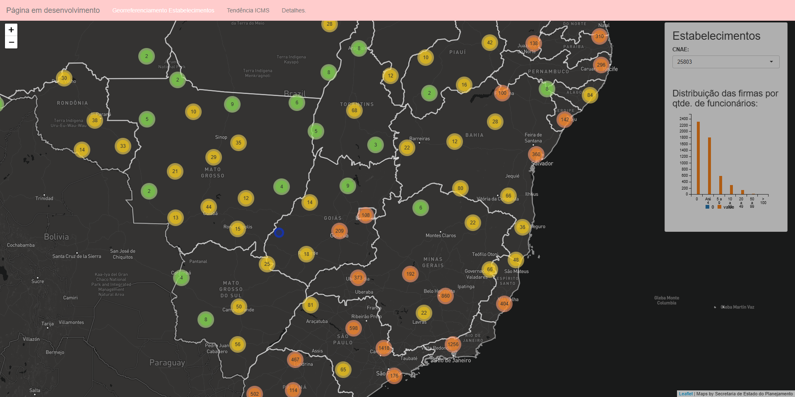

# Empresas e ICMS (text in portuguese)

Essa aplicação foi feita a partir do exemplo _SuperZip_ da galeria do Posit. Os dados utilizados foram extraídos a partir do RAIS estabelecimentos (ftp dos microdados estão [aqui](ftp://ftp.mtps.gov.br/pdet/microdados/RAIS)), para um determinado setor CNAE. Quanto aos dados de ICMS, todavia não me recordo ao certo de onde foi extraído =/

<!--  --> 

