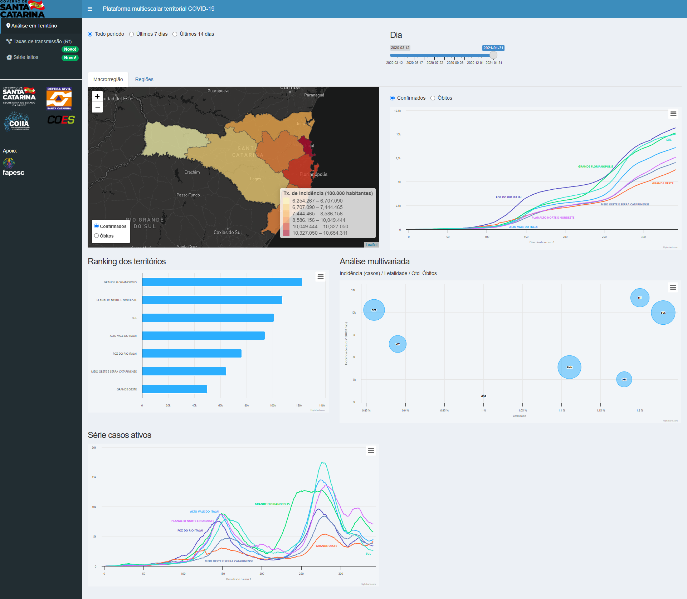

# Covid19 in Santa Catarina State

This application was available by Santa Catarina by Civil Defense department of Santa Catarina State (deactivated in 2023). 

Unfortunelly some of data used to built the app is not longer available, but the Santa Catarina's State Secretary of Health still
provides a daily update of state's Covid19 database [here](https://dados.sc.gov.br/dataset/covid-19-dados-anonimizados-de-casos-confirmados).

Currently i´m serving in my server a few tabs of original application.

<!--  --> 

