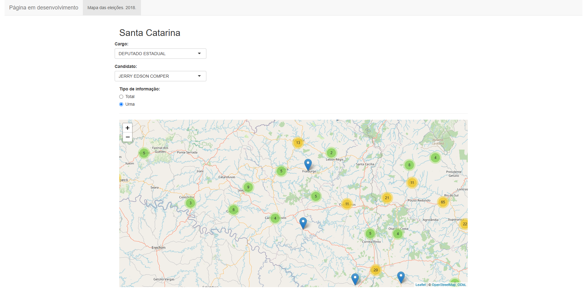

# 2018 State Elections

The goal is to illustrate the spacial distribution of votes by elected federal and state congressman in 2018. The 
database is provided by brazilian Electoral Supreme Court and available [here](https://dadosabertos.tse.jus.br/dataset/resultados-2018).

At the time, to get the schools' coordinates, i've wrote a script to use the google maps API as it was free. But currently 
the _tidygeocoder_ package  or [Nominatim](https://nominatim.org/) API can provide coordinates.

<!--  --> 

