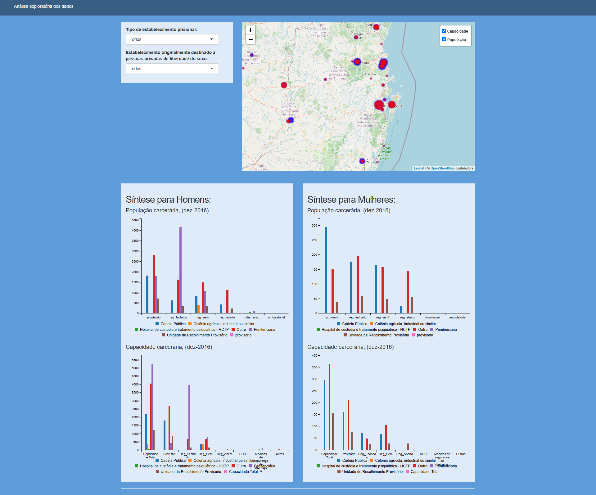

# Santa Catarina prison population 2016

This application summarize some features of incarcerated individuals in Santa Catarina, as of december 2016.

The database is provided by brazilian national penientiary department, available [here](https://www.gov.br/senappen/pt-br/servicos/sisdepen/bases-de-dados).

At the folder _tidying data_ you can find the database and the script used to generate files for the application

<!--  --> 

