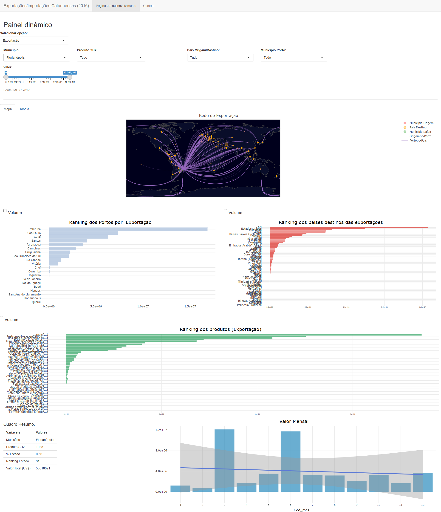

# Export / Imports of Santa Catarina State

This was one of the first shiny application i created. Using old export/import data from MDIC Comex Stat (currently available [here](https://www.gov.br/mdic/pt-br/assuntos/comercio-exterior/estatisticas/base-de-dados-bruta)), the app summarizes the international trade goods from and to Santa Catarina for the year 2016.

<!--  --> 

