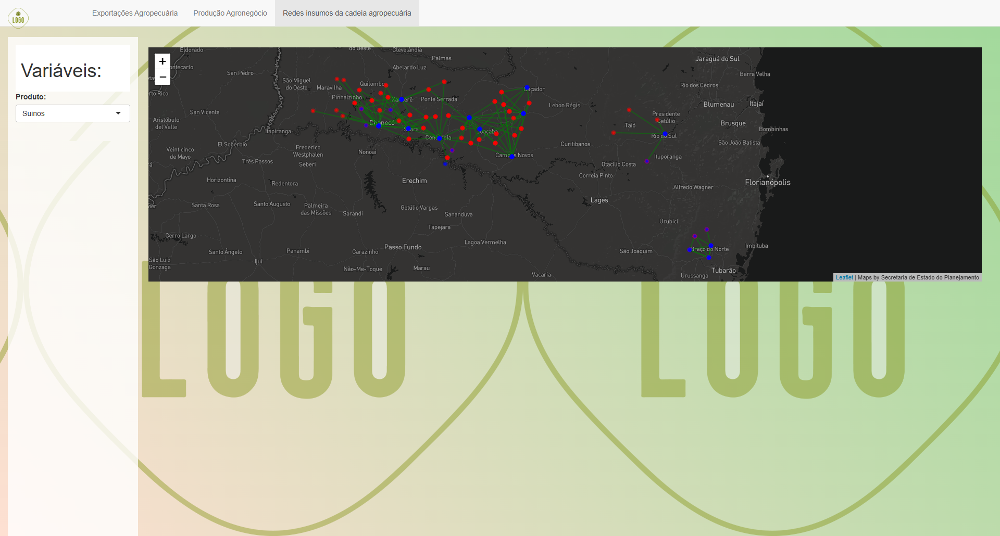

# Exports and input network

This application have used export data from MDIC Comex Stat (available [here](https://www.gov.br/mdic/pt-br/assuntos/comercio-exterior/estatisticas/base-de-dados-bruta)), municipalities Gross Production data provided by IBGE (available [here](https://ftp.ibge.gov.br/Pib_Municipios/)) and agricultural flows from REGIC (portuguese acronym for Cities' Influence Region).

However, the gross production data does not provide information on agribusiness (farming plus agroindustry). To perform this calculus, i used as proxy the share on industry's total wages, and i calculated this using the Annual Social Information Report from RAIS (acronym for Annual Social Information Report), available in [this](ftp://ftp.mtps.gov.br/pdet/microdados/) ftp.

<!--  --> 

