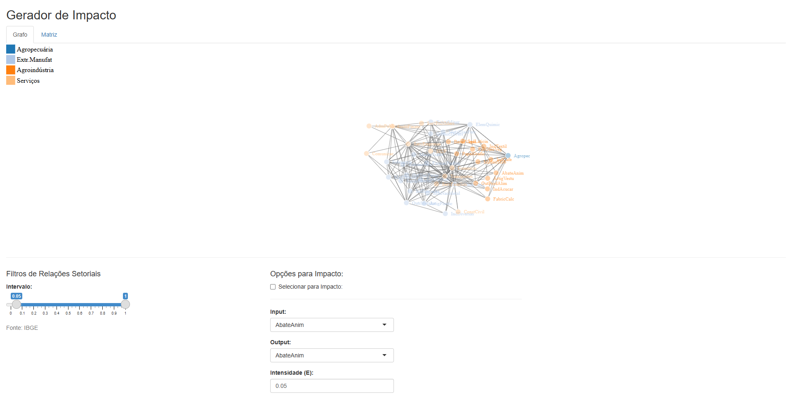

# Leontief's Matrix "Impact Generator"

This is an unfinished project, wich the main idea was to perform a network analysis on a input-output matrix.

The "Impact Generator" refers to the changes in the Leontief Inverse matrix when a specific technical coefficient is altered. This concept is inpired on Sonis and Hewings (1995) _Inflence fields_ concept (the manuscript is available [here](http://www.erudito.fea.usp.br/PortalFEA/Repositorio/835/Documentos/Guilhoto%20Insumo%20Produto.pdf) and the Input-output matrix is provided by IBGE, available [here](https://ftp.ibge.gov.br/Contas_Nacionais/Matriz_de_Insumo_Produto/)).

<!--  --> 

