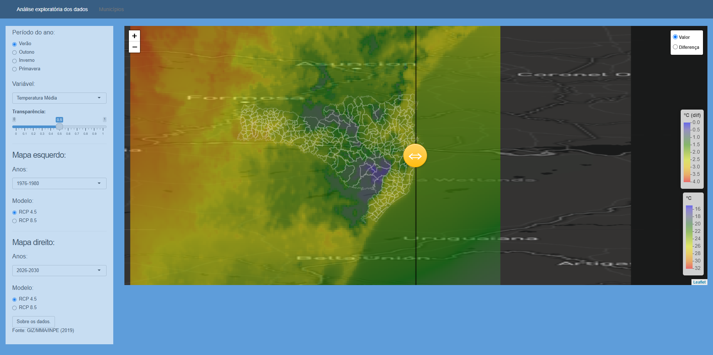

# Climate projections

This application summarize some climate indicators, calculated from _Eta Hadgem_ projection. Sadly, the original data is unavailable for download 
(i get this on a consultancy at Santa Catarina Civil Defense department). But INPE makes some climate projections data available [here](http://www3.cptec.inpe.br/eta/projeta/).

<!--  --> 

