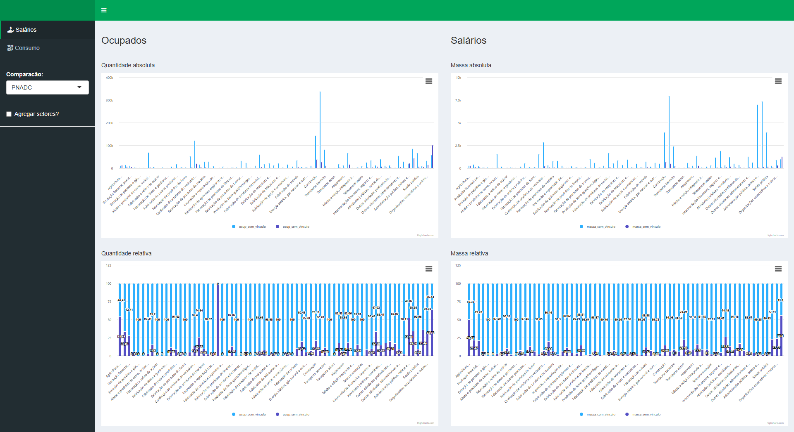

# Consumption and Wages

Here i summarized some information from Pesquisa de Orçamentos Familiares (where i got families consumption data) and from Relação Anual de Informações Sociais - RAIS (where i got wages data)

<!--  --> 

